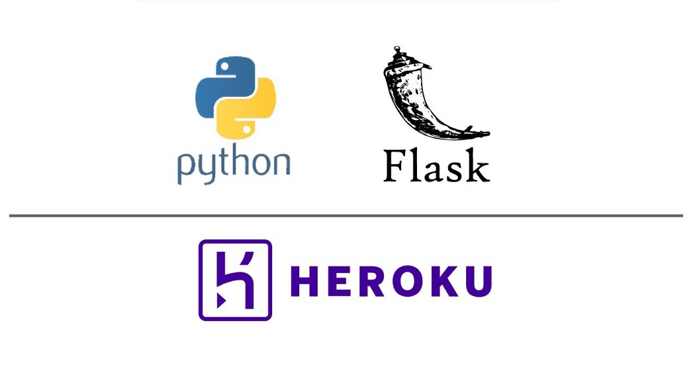
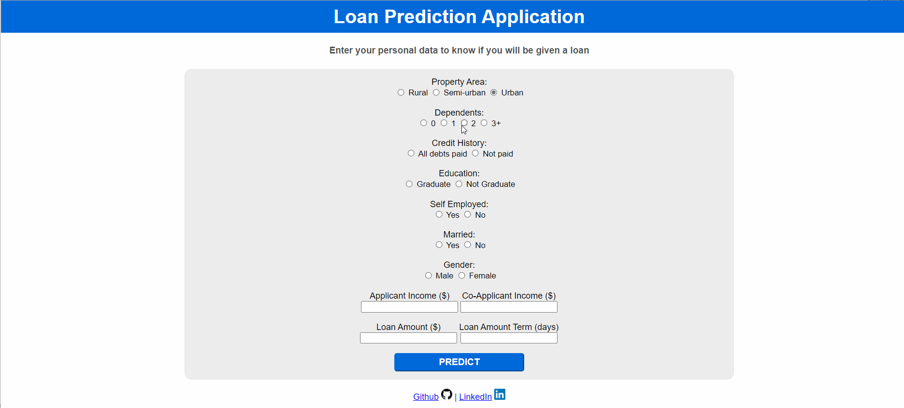

# Deployment of a machine learning model



The objective of this project is to showcase the deployment of a machine learning model. Such model is based on a binary classification that predicts whether a client will be given a loan. Since the main objective is the deployment itself, the approach taken for this classification is a simple one based on a logistic regression model and optimized with recursive feature elimination (RFE). The deployed web-app can be found here: https://loan-prediction-webapp.herokuapp.com/

# Content

A loan application is used by borrowers to apply for a loan. Through the loan application, borrowers reveal key details about their finances to the lender. The loan application is crucial to determining whether the lender will grant the request for funds or credit.

# Problem statement and objective

A bank's filtering process to reject or approve a loan can be a time consuming and tedious process. Therefore, the idea behind this ML project is to build an ML model and web application that the bank can use to classify if a user can be granted a loan or not. 

# Dataset information

The dataset contains information about Loan Applicants. There are 12 independent columns and 1 dependent column. This dataset includes attributes like Loan ID, gender, if the loan applicant is married or not, the level of education, applicant’s income etc.

The training dataset can be downloaded by typing the following line in the Jupyter Notebook (importing pandas as pd):

```
loan_data  = pd.read_csv("https://raw.githubusercontent.com/dphi-official/Datasets/master/Loan_Data/loan_train.csv" )

```

Test dataset can be downloaded with the following line of code (importing pandas as pd):

```
test_data = pd.read_csv('https://raw.githubusercontent.com/dphi-official/Datasets/master/Loan_Data/loan_test.csv')

```

## Feature information:

1. **Loan_ID**: A unique ID assigned to every loan applicant
2. **Gender**: Gender of the applicant (Male, Female)
3. **Married**: The marital status of the applicant (Yes, No)
4. **Dependents**: No. of people dependent on the applicant (0,1,2,3+)
5. **Education**: Education level of the applicant (Graduated, Not Graduated)
6. **Self_Employed**: If the applicant is self-employed or not (Yes, No)
7. **ApplicantIncome**: The amount of income the applicant earns
8. **CoapplicantIncome**: The amount of income the co-applicant earns
9. **LoanAmount**: The amount of loan the applicant has requested for
10. **Loan_Amount_Term**: The  no. of days over which the loan will be paid
11. **Credit_History**: A record of a borrower's responsible repayment of debts (1- has all debts paid, 0- not paid)
12. **Property_Area**: The type of location where the applicant’s property lies (Rural, Semiurban, Urban)

**Target**: 

13. **Loan_Status**: Loan granted or not (1 for granted, 0 for not granted)

# Files/directories in repository

- **jupyter_notebook directory**: contains a Jupyter notebook with the code for the data wrangling and modelling of the dataset
- **model directory**: contains pickled files with the trained logistic regression model, feature encoding and scaling. 
- **static directory**: contains images used for the front-end and a *styles* directory:
  - **styles directory**: contains the CSS stylesheet (index.css)
- **templates directory**: contains the HTML file (index.html)
- **Procfile**: required file for deployment in Heroku. It specifies the commands that are executed by the app on startup. Note that for the deployment to work properly this file cannot have any extension.
- **requierements.txt**: file with versions and libraries necessary for this project.
- **server.py**: back-end code that makes use of Flask as its web framework.

# Model

Model based on logistic regression with recursive feature elimination (RFE) for a binary classification (loan approved or rejected) with an F1-score of 86% on the test set (as shown in the leaderboard of the [Dphi Datathon](https://dphi.tech/challenges/loan-or-no-loan/54/leaderboard/practice/) under the *waiseheil* nickname. The code for the data wrangling and the machine learning model is provided as a Jupyter Notebook.

# Deployment

- Flask is used as the selected framework for the back-end logic. See details in the [server.py](./server.py) file
- The web application is deployed to Heroku. The Procfile and Requierements.txt files and their location in the directory tree should not be changed as for the correct deployment to [Heroku](https://www.heroku.com/). Information on how to deploy to Heroku in conjuction with Git can be found [here](https://devcenter.heroku.com/articles/git)




